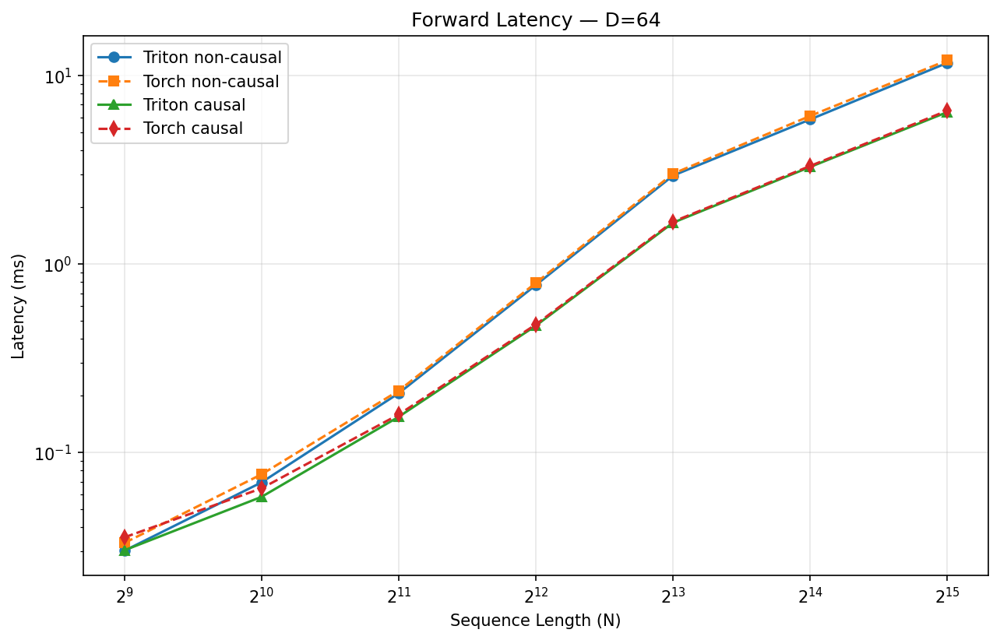
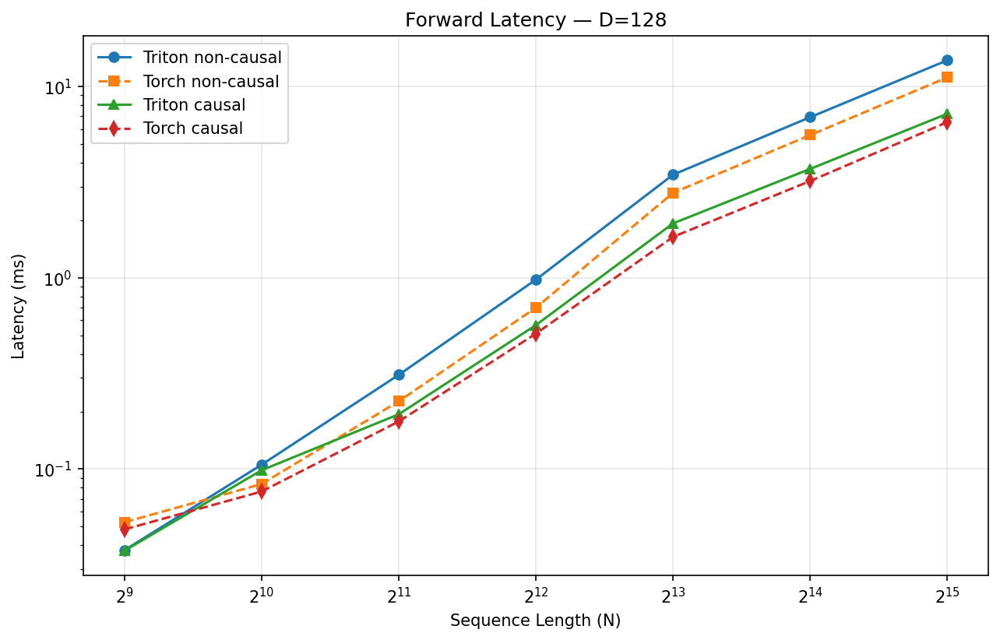
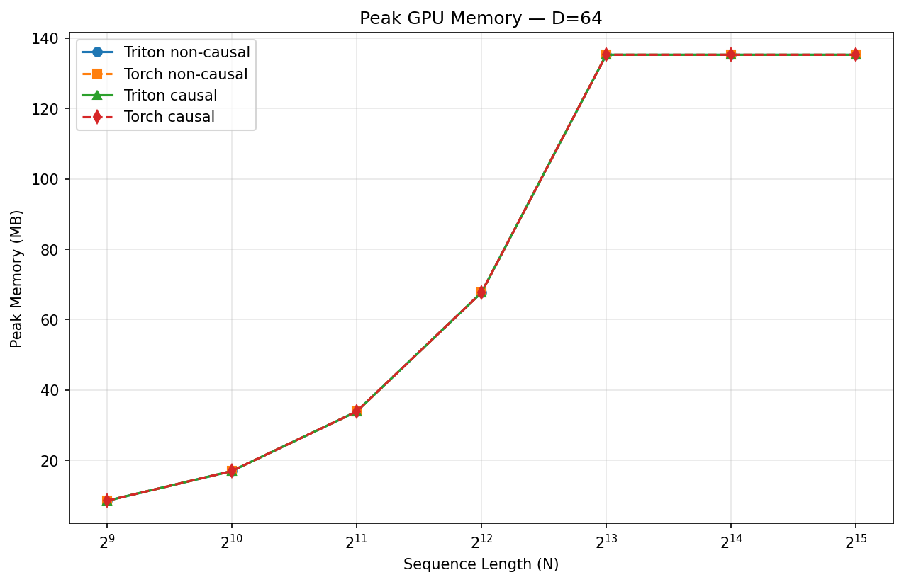
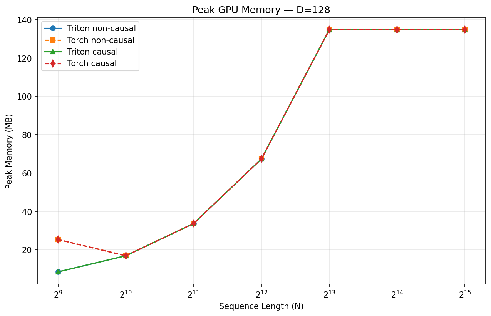
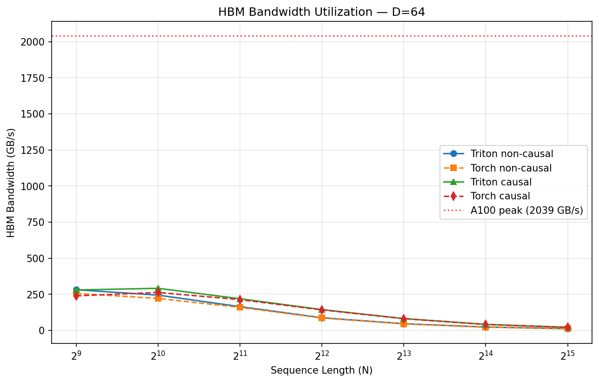
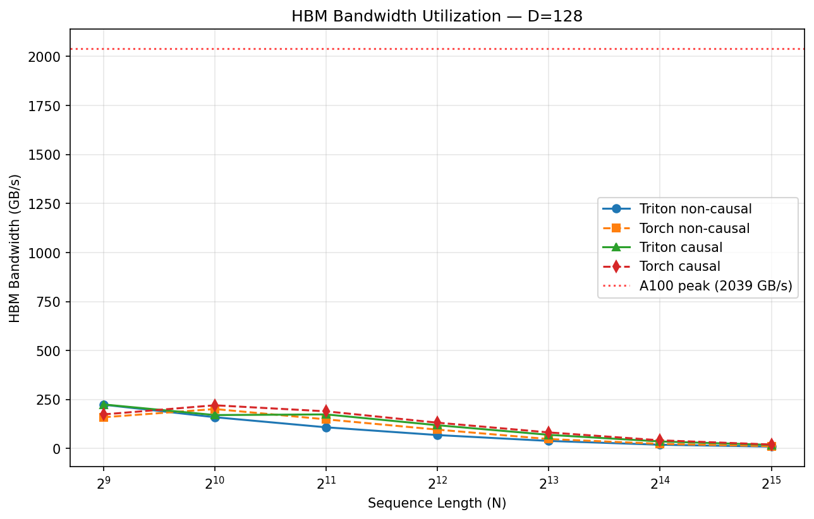
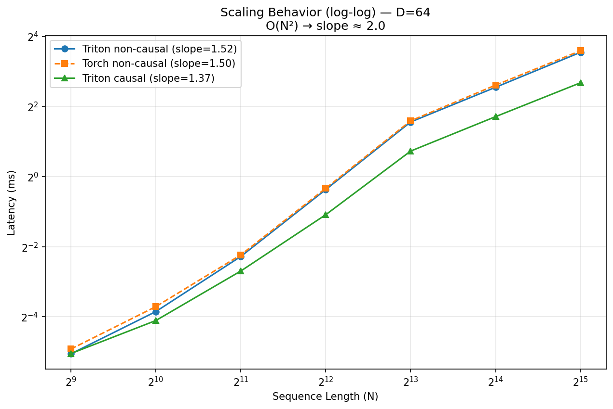
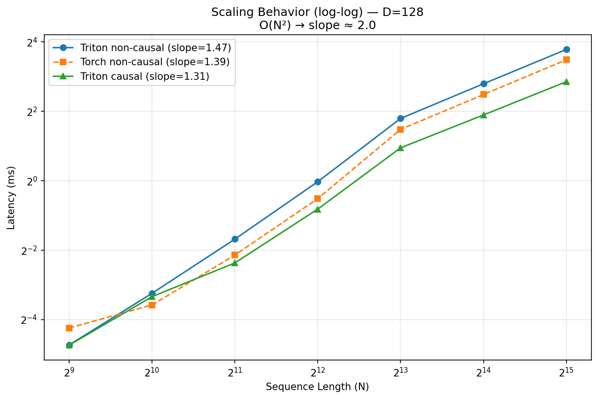

# Triton FlashAttention

A from-scratch implementation of FlashAttention in [Triton](https://triton-lang.org/),
built as a learning exercise from the
[official `06-fused-attention` tutorial](https://triton-lang.org/main/getting-started/tutorials/06-fused-attention.html).

The goal is to understand the algorithm by building it up one piece at a time
(non-causal forward → causal → backward → tuning), then use the finished kernel
as a baseline for comparing other attention variants on a Lambda Labs A100.

See [`ROADMAP.md`](./ROADMAP.md) for the full plan and current status.

## Repository layout

```
flash_attn.py          # Triton kernels (forward + backward) + autograd wrapper
test_flash_attn.py     # Correctness tests vs torch SDPA and fp32 reference
bench_flash_attn.py    # Quick forward TFLOPS / latency vs torch SDPA
benchmark.py           # Comprehensive benchmark (latency, memory, bandwidth, scaling)
plots/                 # Generated benchmark plots and results.json
ROADMAP.md             # Staged plan and parking lot
requirements.txt
```

## Status

| Stage | Description | Status |
|-------|-------------|--------|
| 1 | Non-causal forward | Done |
| 2 | Causal masking (forward + backward) | Done |
| 3 | Backward pass (dQ, dK, dV kernels) | Done |
| 4 | Autotuning (`@triton.autotune`) | Done |
| 5 | Attention variants — GQA | TBD |

## Algorithm in one paragraph

FlashAttention avoids materializing the full N×N attention matrix by walking
K/V in tiles and maintaining three running statistics per query block: the
softmax max `m_i`, the denominator `l_i`, and the output accumulator `acc`.
When a new tile arrives, both the old denominator and the old output are
rescaled by `exp(m_old - m_new)` so that everything is expressed relative to
the latest max. At the end, `acc / l_i` is the exact softmax-attention output.
The five-line update is annotated in `flash_attn.py`. We track `m_i`/`l_i` in
log2 space because `exp2` is faster than `exp` on NVIDIA GPUs.

## Benchmark results (A100 80GB)

All benchmarks run on a single NVIDIA A100 80GB GPU (Lambda Labs).
Comparison is against `torch.nn.functional.scaled_dot_product_attention` (SDPA),
which dispatches to Dao's optimized CUDA FlashAttention under the hood.

### Comparison table

**D=64** — Triton matches or beats Torch SDPA across all sequence lengths:

| N | Mode | Triton (ms) | Torch (ms) | Speedup | Triton BW (GB/s) | Triton TFLOPS |
|------:|----------|--------:|--------:|--------:|--------:|--------:|
| 512 | non-causal | 0.030 | 0.033 | 1.10x | 281 | 71.5 |
| 1024 | non-causal | 0.069 | 0.076 | 1.10x | 244 | 124.0 |
| 2048 | non-causal | 0.206 | 0.212 | 1.03x | 164 | 166.9 |
| 4096 | non-causal | 0.773 | 0.793 | 1.03x | 87 | 177.8 |
| 8192 | non-causal | 2.944 | 3.013 | 1.02x | 46 | 186.7 |
| 16384 | non-causal | 5.849 | 6.105 | 1.04x | 23 | 188.0 |
| 512 | causal | 0.030 | 0.035 | 1.17x | 280 | 71.1 |
| 1024 | causal | 0.058 | 0.064 | 1.11x | 291 | 148.0 |
| 4096 | causal | 0.470 | 0.477 | 1.01x | 144 | 292.2 |
| 8192 | causal | 1.656 | 1.676 | 1.01x | 82 | 331.9 |
| 16384 | causal | 3.273 | 3.312 | 1.01x | 41 | 335.9 |

**D=128** — Triton wins at small N, but Torch pulls ahead at N >= 1024:

| N | Mode | Triton (ms) | Torch (ms) | Speedup | Triton BW (GB/s) | Triton TFLOPS |
|------:|----------|--------:|--------:|--------:|--------:|--------:|
| 512 | non-causal | 0.038 | 0.053 | 1.40x | 224 | 57.1 |
| 1024 | non-causal | 0.105 | 0.084 | 0.79x | 160 | 81.6 |
| 4096 | non-causal | 0.978 | 0.698 | 0.71x | 69 | 140.5 |
| 8192 | non-causal | 3.459 | 2.781 | 0.80x | 39 | 159.0 |
| 16384 | non-causal | 6.912 | 5.575 | 0.81x | 19 | 159.1 |
| 512 | causal | 0.037 | 0.048 | 1.29x | 225 | 57.4 |
| 1024 | causal | 0.099 | 0.076 | 0.77x | 171 | 87.2 |
| 4096 | causal | 0.566 | 0.510 | 0.90x | 119 | 242.9 |
| 8192 | causal | 1.925 | 1.636 | 0.85x | 70 | 285.6 |
| 16384 | causal | 3.709 | 3.206 | 0.86x | 36 | 296.4 |

### Scaling exponents (log-log slope)

| Config | Slope | Notes |
|--------|------:|-------|
| D=64 Triton non-causal | 1.52 | Blend of memory-bound (small N) and compute-bound (large N) |
| D=64 Torch non-causal | 1.50 | Nearly identical scaling — same algorithm |
| D=64 Triton causal | 1.37 | Lower slope: causal skip shifts balance toward memory-bound |
| D=128 Triton non-causal | 1.47 | Same scaling, constant-factor slower than Torch |
| D=128 Torch non-causal | 1.39 | |
| D=128 Triton causal | 1.31 | |

Pure O(N²) would give slope = 2.0. Observed slopes are lower because small-N
regime is memory-bound (closer to O(N)) while large-N is compute-bound (closer
to O(N²)). The fitted line blends both regimes.

### Plots

#### Latency (forward pass)

| D=64 | D=128 |
|------|-------|
|  |  |

D=64: Triton matches Torch SDPA across all N. Causal is faster than non-causal
due to early-exit (skipping upper-triangle tiles).

D=128: Triton non-causal falls behind starting at N=1024. With `BLOCK_M` reduced
from 128 to 64 (to fit larger D in SRAM), each tile does less compute per K/V
load, reducing arithmetic intensity. Dao's CUDA kernel handles this better with
manual warp-level register tiling.

#### Peak GPU memory

| D=64 | D=128 |
|------|-------|
|  |  |

All lines overlap — both implementations are O(N) in memory (no N×N attention
matrix materialized). The plateau at ~135MB is an artifact of the benchmark
reducing batch size / heads at large N to avoid OOM.

D=128 at small N: Torch allocates ~25MB vs Triton's ~9MB due to PyTorch's CUDA
caching allocator and internal workspace buffers.

#### HBM bandwidth utilization

| D=64 | D=128 |
|------|-------|
|  |  |

Bandwidth peaks at ~300 GB/s for small N (memory-bound regime) and drops toward
~20 GB/s at large N. This is far below the A100's 2039 GB/s peak because at
large N the kernel is **compute-bound** — tensor cores are busy with N² matmuls
while the memory bus sits idle. FlashAttention's tiling successfully keeps data
in SRAM for reuse.

#### Scaling behavior (log-log)

| D=64 | D=128 |
|------|-------|
|  |  |

Log-log slope measures empirical scaling exponent (O(N²) → slope 2.0). All slopes
fall between 1.3–1.5, reflecting the transition from memory-bound (O(N)-like) at
small N to compute-bound (O(N²)-like) at large N.

### Key findings

1. **D=64 is competitive**: Our Triton kernel matches or slightly beats Torch
   SDPA (backed by Dao's hand-optimized CUDA) at D=64, achieving 1.01–1.17x
   speedup across all tested sequence lengths.

2. **D=128 constant-factor gap**: At D=128, Triton is ~20% slower for non-causal.
   The root cause is reduced `BLOCK_M` (64 vs 128) lowering arithmetic intensity.
   Dao's CUDA kernel compensates with warp-level register optimizations that
   Triton's compiler cannot yet match.

3. **Memory is identical**: Both implementations are O(N) — the whole point of
   FlashAttention. Neither materializes the N×N attention matrix.

4. **Causal masking works**: Early-exit tile skipping gives ~1.7x speedup over
   non-causal at large N (as expected from skipping ~half the triangle).

5. **Regime transition**: Small N is memory-bound (high bandwidth, low TFLOPS).
   Large N is compute-bound (low bandwidth, high TFLOPS). The crossover is around
   N=2048–4096.

## Attention variants

| Variant | Description | Status |
|---------|-------------|--------|
| FlashAttention (full) | Standard multi-head, non-causal + causal | Done |
| GQA (Grouped-Query Attention) | Multiple Q heads share fewer K/V heads | TBD |

## Running it (remote GPU)

This project develops locally on macOS but runs on a remote NVIDIA GPU
(targeting an A100 on Lambda Labs). Triton kernels cannot run on Mac.

```sh
# on the remote box
pip install -r requirements.txt

# correctness
pytest -xvs test_flash_attn.py

# forward-only benchmark (quick)
python bench_flash_attn.py

# comprehensive benchmark with plots
python benchmark.py
# generates plots/ directory with PNGs and results.json
```

## API

```python
from flash_attn import flash_attn_forward, flash_attention

# Forward only
# q, k, v: (Z, H, N, D) on CUDA, fp16 or bf16
out, lse = flash_attn_forward(q, k, v, sm_scale=None, causal=False)
# out: (Z, H, N, D)  — attention output, same dtype as q
# lse: (Z, H, N)     — logsumexp, kept for backward pass

# Forward + backward (autograd)
out = flash_attention(q, k, v, sm_scale=None, causal=False)
out.sum().backward()  # q.grad, k.grad, v.grad populated
```

`sm_scale` defaults to `1/sqrt(D)`.

## References

- Dao et al., [FlashAttention-2](https://arxiv.org/abs/2307.08691)
- [Triton tutorial 06](https://triton-lang.org/main/getting-started/tutorials/06-fused-attention.html)
- Milakov & Gimelshein, [Online normalizer calculation for softmax](https://arxiv.org/abs/1805.02867)
